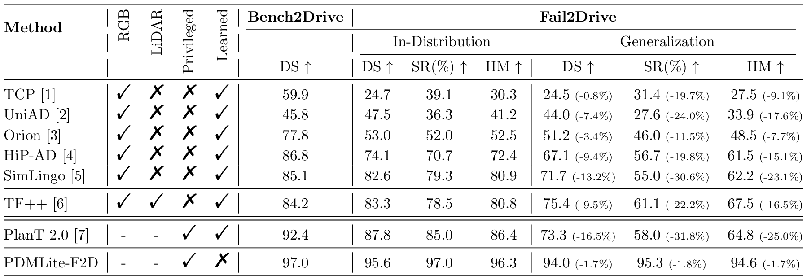

# Fail2Drive Leaderboard



> Feel free to use the rendered table image ([`rendered/table.png`](rendered/table.png)) or the LaTeX source ([`f2d_leaderboard.tex`](f2d_leaderboard.tex)) directly in your papers. BibTeX entries for every method on the leaderboard are collected in [`references.bib`](references.bib).

## Contributing

Want to add your model? See [CONTRIBUTING.md](CONTRIBUTING.md).

## About Fail2Drive

Fail2Drive is the first CARLA v2 benchmark designed to test closed-loop generalization on truly unseen long-tail scenarios. It pairs shifted routes with in-distribution reference scenarios to expose hidden failure modes in state-of-the-art driving models.

<p align="center">
  <a href="https://simonger.github.io/fail2drive/">Project Page</a> &nbsp;|&nbsp;
  <a href="https://arxiv.org/pdf/2604.08535">Paper</a> &nbsp;|&nbsp;
  <a href="https://huggingface.co/datasets/SimonGer/Fail2Drive">Download</a> &nbsp;|&nbsp;
  <a href="https://discord.gg/HZ83Em6kyZ">Discord</a>
</p>

## Citation

```bibtex
@misc{gerstenecker2026fail2drivebenchmarkingclosedloopdriving,
      title={Fail2Drive: Benchmarking Closed-Loop Driving Generalization}, 
      author={Simon Gerstenecker and Andreas Geiger and Katrin Renz},
      year={2026},
      eprint={2604.08535},
      archivePrefix={arXiv},
      primaryClass={cs.RO},
      url={https://arxiv.org/abs/2604.08535}, 
}
```
